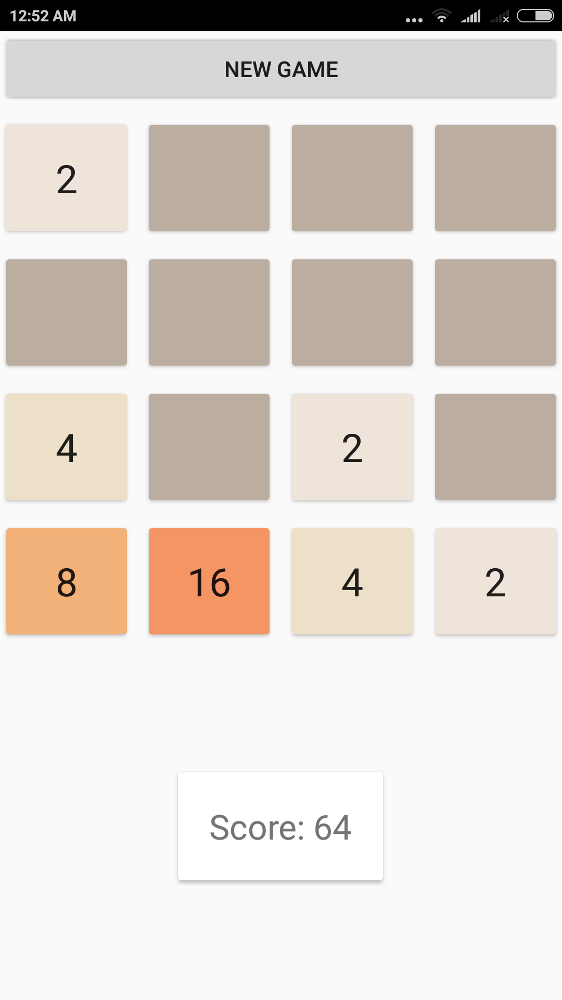

### Goal of this project is to create simple version of 2048 game

#### how app looks

#### Resourses:
* [how to generate apk](https://www.youtube.com/watch?v=j5hnbKJelH8&feature=youtu.be)
* [how to add click handler](https://www.youtube.com/watch?v=gm-RgfdaISU)

#### TODO:
* add animations
* add separate class for game logic
* tile should be square
* change app icon
* show gameover pop up right away (now it is showing after user attempts to move) 
* add swipe (remove buttons) or add normal buttons [SOLVED]
* detect gameover [SOLVED]
* don't add number when nothing moved [SOLVED]
* add colors [SOLVED]
* prevent switching to landscape [SOLVED]
* add sometimes 4 to gameboard [SOLVED]
* change app name [SOLVED]
* add ability to choose board size 3x3, 4x4 [SOLVED]
* add score [SOLVED]
* add button to start new game [SOLVED]